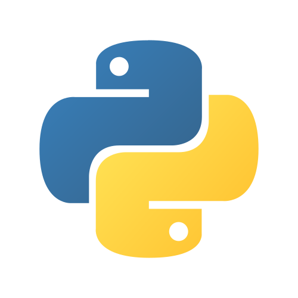

<h1 align="center">👋🏻 I'm Orangel Jose 👨🏻‍💻</h1>
<h3 align="center"><em>Frontend Developer</em></h3>

```JS
const lonchop = {
    pronouns: "He" | "Him",
    code: ["HTML", "CSS", "JavaScript", "TypeScript", "React", "Next", "Vue" "Tailwind", "Figma"],
};
```

## 💻 Languages and Tools...

<div align="center">
    
    
    
    
    
    
    
    
    
</div>

## ✨ Find me in other places

- In Linkedin [Orangel Jose Gonzalez Urbina](https://www.linkedin.com/in/orangel-gonzalez/)
